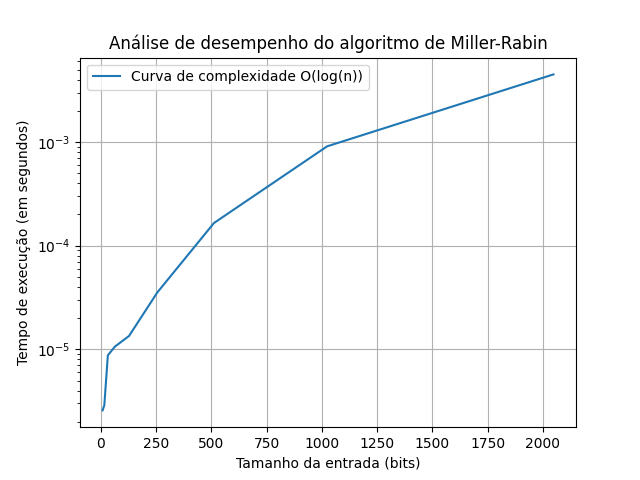
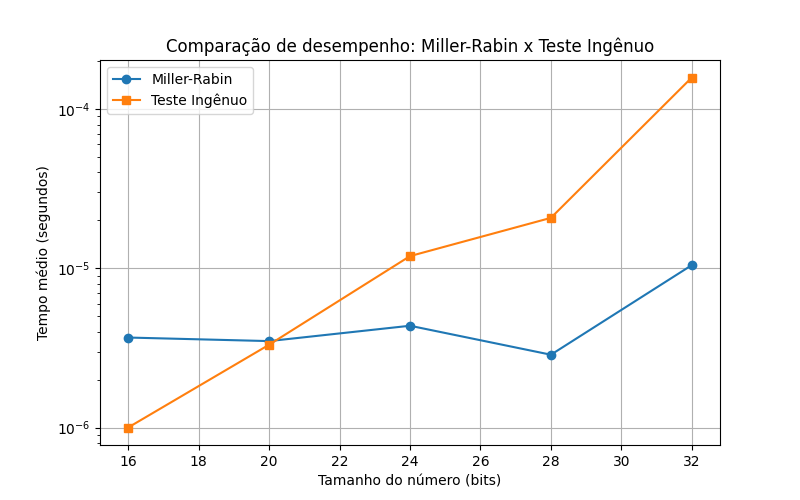
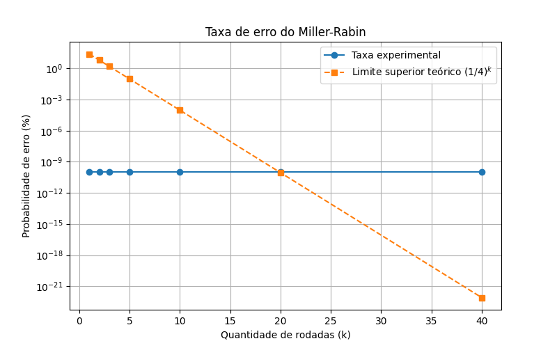

# 🔐 Teste de Primalidade de Miller-Rabin

Projeto desenvolvido para a disciplina de **Fundamentos de Matemática para Ciência da Computação II (FMCC2)**.

O objetivo deste projeto é implementar e analisar o **Teste de Miller-Rabin**, um algoritmo probabilístico utilizado para verificar se um número inteiro é primo.

---

# 📚 Introdução

O **Teste de Miller-Rabin**, criado pelos matemáticos **Gary Miller** e **Michael Rabin**, é um dos algoritmos mais utilizados para verificar a primalidade de números grandes.

Diferente dos métodos tradicionais, como testar todos os possíveis divisores até a raiz quadrada de um número, o Miller-Rabin utiliza propriedades da aritmética modular para realizar o teste de forma mais eficiente.

Esse algoritmo possui grande importância na área de criptografia, sendo utilizado, por exemplo, na geração de números primos para criação de chaves no sistema RSA.

---

# 🔎 Confiabilidade do Teste

O Miller-Rabin é considerado um teste **probabilístico**, pois existe uma pequena possibilidade de um número composto ser identificado como primo.

Para um número composto `n`, a chance de uma rodada do teste apresentar um resultado incorreto é limitada por:

$$
P(\text{erro}) \leq \frac{1}{4}
$$

Por isso, o algoritmo pode ser executado várias vezes utilizando diferentes bases (testemunhas). A cada nova rodada, a probabilidade de erro diminui:

$$
P(\text{erro após } k \text{ rodadas}) \leq \left(\frac{1}{4}\right)^k
$$

Neste projeto, utilizamos múltiplas rodadas para aumentar a confiabilidade do resultado.

Exemplo:

**5 rodadas:**

$$
\left(\frac{1}{4}\right)^5 = \frac{1}{1024}
$$

**10 rodadas:**

$$
\left(\frac{1}{4}\right)^{10} = \frac{1}{1048576}
$$

---

# 🧮 Fundamentação Matemática

O funcionamento do Miller-Rabin utiliza conceitos de números primos e aritmética modular.

Pelo **Pequeno Teorema de Fermat**, se `n` é primo e `a` é um número coprimo com `n`, então:

$$
a^{n-1} \equiv 1 \pmod n
$$

O Miller-Rabin utiliza uma forma mais completa dessa ideia, escrevendo:

$$
n-1 = 2^s \cdot d
$$

onde:

* `s` é um número inteiro não negativo;
* `d` é um número ímpar.

A partir disso, uma base `a` não consegue provar que `n` é composto caso uma das condições seja satisfeita:

$$
a^d \equiv 1 \pmod n
$$

ou

$$
a^{2^r d} \equiv -1 \pmod n
$$

para algum:

$$
0 \leq r < s
$$

Caso nenhuma dessas condições seja satisfeita, a base escolhida é uma **testemunha de composição**, indicando que:

$$
n \text{ é composto}
$$

---

# ⚙️ Funcionamento do Algoritmo

O funcionamento do algoritmo pode ser resumido nos seguintes passos:

1. Recebe um número inteiro `n`.
2. Realiza a decomposição:

$$
n-1 = 2^s \cdot d
$$

3. Escolhe uma base aleatória `a`.
4. Calcula:

$$
x = a^d \bmod n
$$

5. Verifica se:

   * `x = 1`; ou
   * algum valor obtido através de sucessivas potências de `x² mod n` é igual a `n-1`.

6. Repete esse processo por uma quantidade definida de rodadas para aumentar a confiabilidade do teste.

---

# ▶️ Instruções de Uso

## Pré-requisitos

* Python 3.10 ou superior;
* Biblioteca `sympy`.
* Biblioteca `matplotlib`

Instale a dependência com:

```bash
pip install -r requirements.txt
```

## Executando o programa

Na raiz do projeto, execute:

```bash
python main.py
```

O programa irá abrir um menu com as opções:

| Opção | Descrição                                                         |
| :---: | :---------------------------------------------------------------- |
| **1** | Testar um número utilizando o algoritmo de Miller-Rabin.          |
| **2** | Gerar o gráfico de desempenho (bits × tempo).                     |
| **3** | Gerar o gráfico da taxa de erro utilizando números de Carmichael. |
| **4** | Comparar o desempenho do Miller-Rabin com o método ingênuo.       |
| **5** | Executar todos os gráficos.                                       |
| **6** | Executar todos os testes implementados.                           |
| **0** | Encerrar o programa.                                              |

---

## Estrutura do Projeto

A organização dos arquivos do projeto está dividida em três partes principais: **algoritmo**, onde fica a implementação do Miller-Rabin; **testes**, onde estão os casos utilizados para validar o algoritmo; e **graficos**, onde são gerados os resultados experimentais.

```text
.
├── algoritmo
│   ├── decomposicao.py
│   ├── main_miller_rabin.py
│   ├── miller_rabin.py
│   └── testemunha.py
│
├── graficos
│   ├── comparacao.py
│   ├── desempenho.py
│   └── erro.py
│
├── testes
│   ├── comparacao.py
│   ├── testes_basicos.py
│   ├── testes_carmichael.py
│   └── testes_de_estresse.py
│
├── utils
│   ├── comparacao.png
│   ├── desempenho.png
│   └── taxa_erro.png
│
├── main.py
└── README.md
```


# 📊 Resultados Experimentais

Os gráficos foram gerados a partir dos testes realizados com a implementação do Miller-Rabin. Eles foram utilizados para analisar o comportamento do algoritmo em diferentes situações.

---

## ⏱️ Desempenho do Algoritmo

Este gráfico mostra como o tempo de execução varia conforme aumentamos o tamanho dos números utilizados no teste.

Foram utilizados números com diferentes quantidades de bits, calculando o tempo médio de execução para cada tamanho.

O objetivo é observar se o crescimento do tempo acompanha o comportamento esperado do algoritmo:

$$
O(k \log n)
$$



---

## ⚖️ Comparação entre Miller-Rabin e Método Ingênuo

Neste gráfico é feita uma comparação entre o Miller-Rabin e o método tradicional que testa os possíveis divisores de um número.

O método ingênuo possui um custo maior para números grandes, pois precisa verificar uma quantidade maior de possibilidades.

A comparação mostra a vantagem do Miller-Rabin ao trabalhar com números maiores.



---

## ❌ Taxa de Erro do Teste

Este gráfico apresenta a taxa de erro do Miller-Rabin utilizando números de Carmichael, que são casos conhecidos por dificultarem testes de primalidade mais simples.

A medida que aumentamos o número de rodadas, a chance de erro diminui:

$$
P(\text{erro}) \leq \left(\frac{1}{4}\right)^k
$$

Isso mostra que poucas rodadas já são suficientes para obter uma alta confiabilidade.



---

# 🚀 Complexidade

Em cada rodada do Miller-Rabin são realizadas operações de exponenciação modular, que possuem custo:

$$
O(\log n)
$$

Como o teste é repetido `k` vezes, a complexidade final é:

$$
O(k \log n)
$$

Como normalmente usamos um valor pequeno para `k`, o algoritmo consegue testar números grandes em um tempo eficiente.

---

# 📌 Aplicações

O Miller-Rabin é utilizado principalmente em:

* 🔑 Geração de chaves criptográficas, como no RSA;
* 🔐 Sistemas de segurança digital;
* 📡 Protocolos de comunicação segura;
* 🔢 Testes de primalidade de números grandes.

---

# 👥 Integrantes

* Thalles Gabriel Saraiva de Lira Silva
* João Raphannely Medeiros Silva
* Hilbert Machado Gomes
* Mateus Soares da Rocha Cordeiro
* Eva Braga Santos
